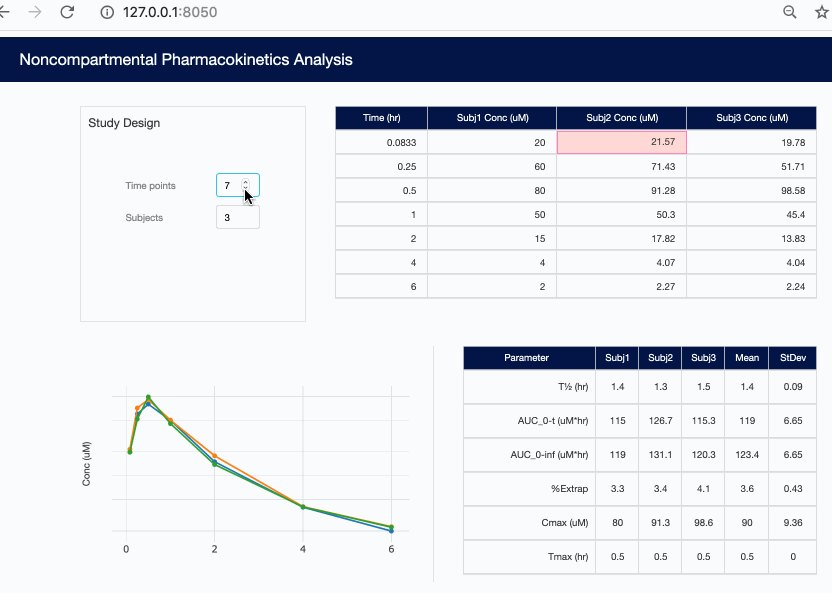

# PKcalc

## About this app

This app calculates pharmacokinetic parameters from entered plasma
concentrations for up to 48 subjects.

### Noncompartmental Pharmacokinetics Analysis (NCA)

Noncompartmental pharmacokinetics is typically used to analyze data from
small animal studies during the lead optimization phase of drug discovery.
These studies are used to help predict human dosing and plan safety studies.

## How to run this app

(The following instructions apply to Posix/bash. Windows users should check
[here](https://docs.python.org/3/library/venv.html).)

First, clone this repository and open a terminal inside the root folder.

Create and activate a new virtual environment (recommended) by running
the following:

```bash

python3 -m venv myvenv

source myvenv/bin/activate

```

Install the requirements:

```bash
pip install -r requirements.txt
```
Run the app:

```bash
python app.py
```
Open a browser at http://127.0.0.1:8050

## Screenshots



## Notes:
* AUC values are calculated using the trapezoid rule on non-logged
concentrations.
* The AUC calculation includes t=0, even if no concentration is entered, in which
case the concentration is assumed to be zero.
* The terminal elimination rate, used to determine t<sub>1/2</sub> and
AUC<sub>0-inf</sub>, is calculated from the final three time points.    

