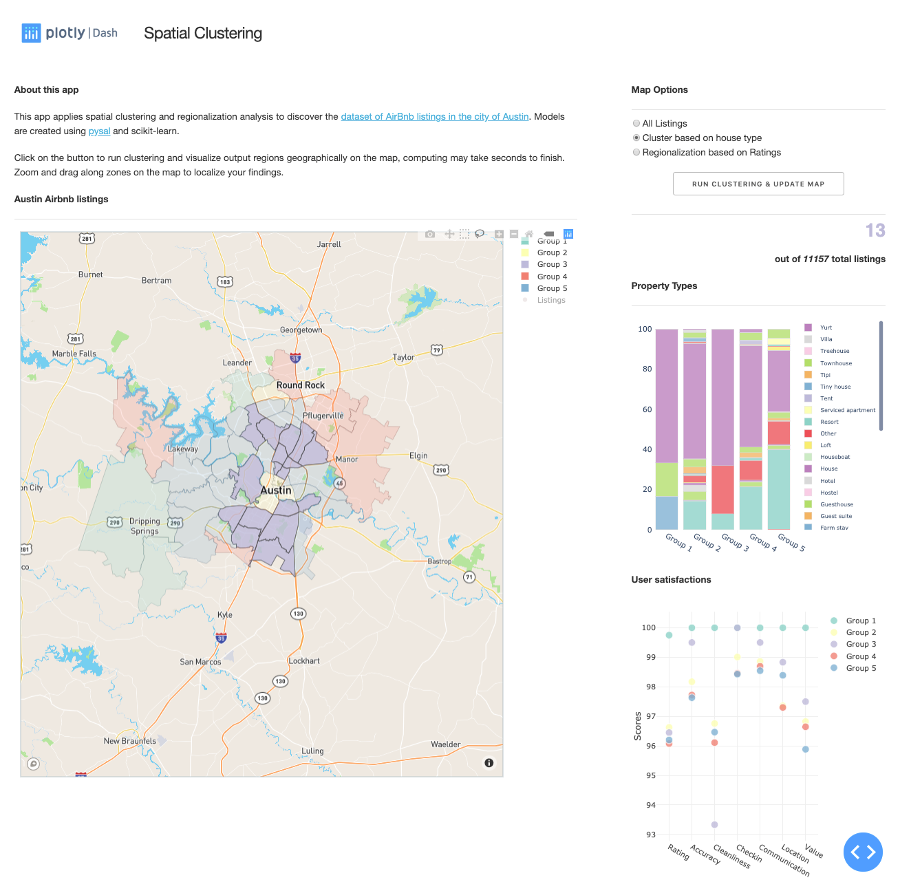

# Dash Spatial Clustering

## About this app

This app applies spatial clustering and regionalization analysis to discover the dataset of AirBnb listings 
in the city of Austin. Models are created using [pysal](https://pysal.readthedocs.io/en/latest/) and scikit-learn.

## How to use this app

Select the type of model from radioitem, click on the button `Run cluster and Update map` to run spatial clustering and visualize output regions 
geographically on the map, computing may take seconds to finish. Zoom and click on regions from the map to update
the number of airbnb listings from your highlighted group.



## Data and models
- Dataset for Airbnb listings are downloaded from http://insideairbnb.com/get-the-data.html
- Austin Zipcodes Boundaries are downloaded from https://github.com/darribas/gds_scipy16/tree/master/content
The original source is provided by the City of Austin GIS Division.

This dataset includes attributes such as number of beds and bathrooms, property types, reviews, amenities, 
calendar bookings and all other related information for individual airbnb listing.
Two models are explored in this app:
- **Clustering** 

Classify city's zipcode into a pre-defined number of groups based on house types, to allow us to extract patterns
about the main kinds of houses and areas in the city. This is done by Scikit-learn KMeans clustering.
    
-  **Regionalization (building meaningful regions)**

Unsupervised classification which creates aggregations of zipcodes into groups that have areas where Airbnb
listed location have similar ratings. This helps us to find out what are the boundaries that separate areas where 
AirBnb users tend to be satisfied about their experience versus those where the ratings are not as high. 
Algorithm used here is from Pysal maxP regionalization.

## Activate environment

Clone the git repo, then install all packages in virtual environment.

```
cd dash-spatial-clustering
conda create -n myvenv python=3.6
conda activate myvenv
pip install -r requirements.txt
```

Run the app
```python
python app.py
```
Your app will be ready to view at http://127.0.0.1:8051/


Inspired by [Spatial clustering notebook](http://darribas.org/gds_scipy16/ipynb_md/07_spatial_clustering.html)
